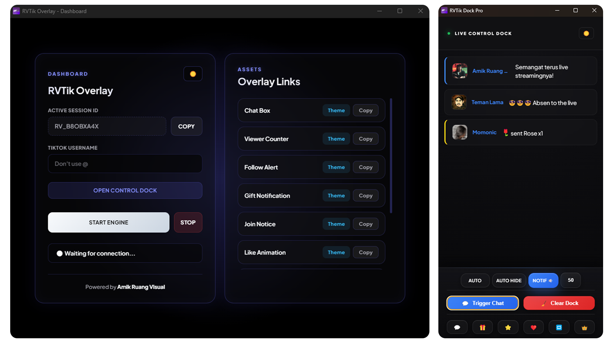
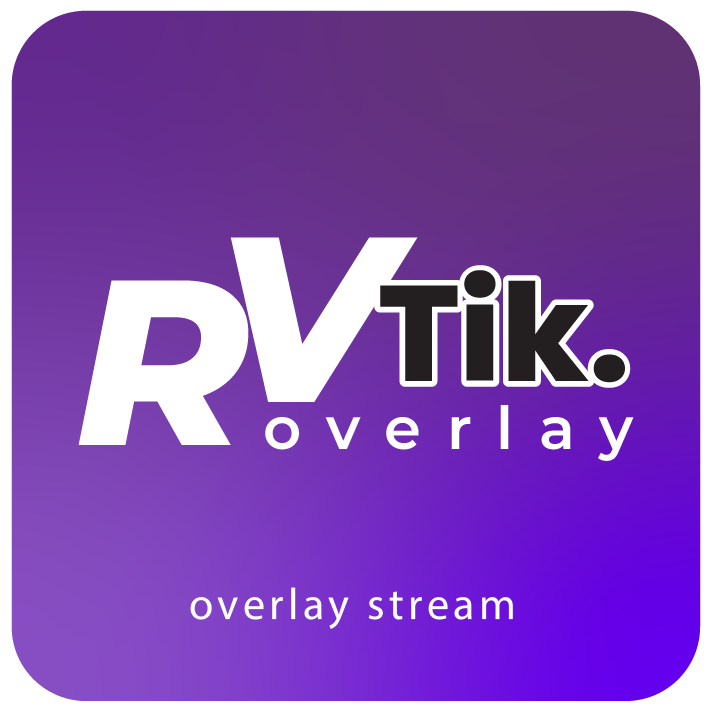

<!-- BADGES -->

[![Stars][stars-shield]][stars-url]
[![Downloads][downloads-shield]][downloads-url]
[![License][license-shield]][license-url]

 

# 

<h1 align="center">🎥 RVTik S T R E A M V 5 NEW</h1>

  ### Real-Time TikTok Live Overlay
Real-Time Overlay System for TikTok Live Streamers
 
Chat • Gift • Join • Viewers
  

<a href="https://ruangvisual.github.io/rvtic-stream-overlay"><strong>Documentation »</strong></a>
  

<a href="https://ruangvisual.github.io/rvtic-stream-overlay/RVTik-Stream-Overlay-Setup-5.0.0.zip">⬇ Download for Windows</a>

---

# 📦 Download

Download versi terbaru RVTik Stream Overlay:

Setelah download:

1. Extract file jika masih dalam bentuk ZIP  
2. Jalankan

RVTik.exe

Jika Windows Defender muncul warning:

More Info → Run Anyway

---

# 🎥 Tentang RVTik

**RVTik Stream Overlay** adalah aplikasi desktop yang membantu streamer TikTok menampilkan interaksi penonton secara **real-time langsung di layar streaming**.

Event yang bisa ditampilkan:

- 💬 Chat Overlay
- 👀 Viewer Counter
- 🎁 Gift Alerts
- 🙋 Join Notifications
- 🔗 Share Notification
- 👨‍🎤 Follow Notification
- 👁️ Viewer Overlay
- 📋 LikeBoard
- 📋 Leaderboard GIFT
  

Overlay dapat digunakan di software streaming seperti:

- OBS Studio
- Streamlabs
- TikTok Live Studio
- Software lain yang mendukung **Browser Source**
- 

---

# ⚡ Cara Menggunakan

1 Jalankan aplikasi RVTik  

2 Masukkan **Username TikTok Live**

3 Klik tombol

START

4 Copy **Overlay Link**

5 Tambahkan ke OBS

Sources → Browser Source

Ukuran yang direkomendasikan:

1920 x 1080

Overlay akan muncul otomatis saat live berjalan.

---

# ☕ Traktir Kopi Developer

Jika aplikasi ini membantu streaming kamu, kamu bisa traktir kopi developer.

👉 https://sibagi.com/amikruangvisual

Support kecil dari kamu sangat membantu pengembangan project ini ❤️

---

# ❤️ Open Donatur / Supporter

Terima kasih kepada semua yang mendukung project ini.

Supporter akan ditampilkan di halaman ini.

### Donatur

Jika kamu ingin mendukung project ini:

👉 https://sibagi.com/amikruangvisual

---

# ⭐ Support Project

Jika kamu menyukai project ini, bantu dengan:

⭐ **Star repository ini di GitHub**

Ini sangat membantu project berkembang lebih jauh.

---

# 👨‍💻 Developer

**Amik — Ruang Visual**

TikTok  
https://www.tiktok.com/@dailylife.emix

Instagram  
@dailylife.emix

---

# 🔗 Project Page

Website  
https://ruangvisual.github.io/rvtic-stream-overlay

---

## Open Source Libraries

RVTik is built using several open-source libraries that power the application and make development possible.  
We are grateful to the developers and communities behind these projects.

---

## Core Technologies

### Electron

Framework used to build the RVTik desktop application using web technologies.

- **License:** MIT  
- **Website:** https://www.electronjs.org/

---

### Electron Builder

Used to package and distribute RVTik as a desktop installer.

- **License:** MIT  
- **Website:** https://www.electron.build/

---

## Streaming Integration

### TikTok Live Connector

Library used to receive TikTok Live events such as:

- Likes  
- Gifts  
- Comments  
- Followers  

- **Repository:**  
  https://github.com/zerodytrash/TikTok-Live-Connector

- **License:** MIT

---

## Networking

### WS WebSocket Library

Used for real-time communication between:

- RVTik Connector  
- RVTik Dashboard  
- RVTik Overlay  

- **Repository:**  
  https://github.com/websockets/ws

- **License:** MIT

---

## DOM INJECT

### Social Stream Ninja

RVTik development was partially inspired by concepts used in **Social Stream Ninja**, an open-source project that enables real-time chat capture and browser overlay systems for live streaming.

Social Stream Ninja has helped shape the ecosystem of browser-based streaming overlays used by creators worldwide.

We thank the project and its contributors for their work in advancing open-source streaming tools.

- **Repository:**  
https://github.com/steveseguin/social_stream

- **Website:**  
https://socialstream.ninja

- **License:** MIT

## Optional Integration

### OBS WebSocket JS

Allows RVTik to communicate with OBS Studio for advanced stream automation.

- **Repository:**  
  https://github.com/obs-websocket-community-projects/obs-websocket-js

- **License:** MIT

---

## Acknowledgment

RVTik would not be possible without the open-source community.  
We sincerely thank all developers who maintain and contribute to these amazing projects.

<!-- MARKDOWN LINKS -->

[stars-shield]: https://img.shields.io/github/stars/ruangvisual/rvtic-stream-overlay?style=for-the-badge
[stars-url]: https://github.com/ruangvisual/rvtic-stream-overlay/stargazers

[downloads-shield]: https://img.shields.io/badge/download-windows-blue?style=for-the-badge
[downloads-url]: https://drive.google.com/uc?export=download&id=17ev6LMVbQ749s1k_vDqoSPHSLXCEV5LY

[license-shield]: https://img.shields.io/github/license/ruangvisual/rvtic-stream-overlay?style=for-the-badge
[license-url]: https://github.com/ruangvisual/rvtic-stream-overlay